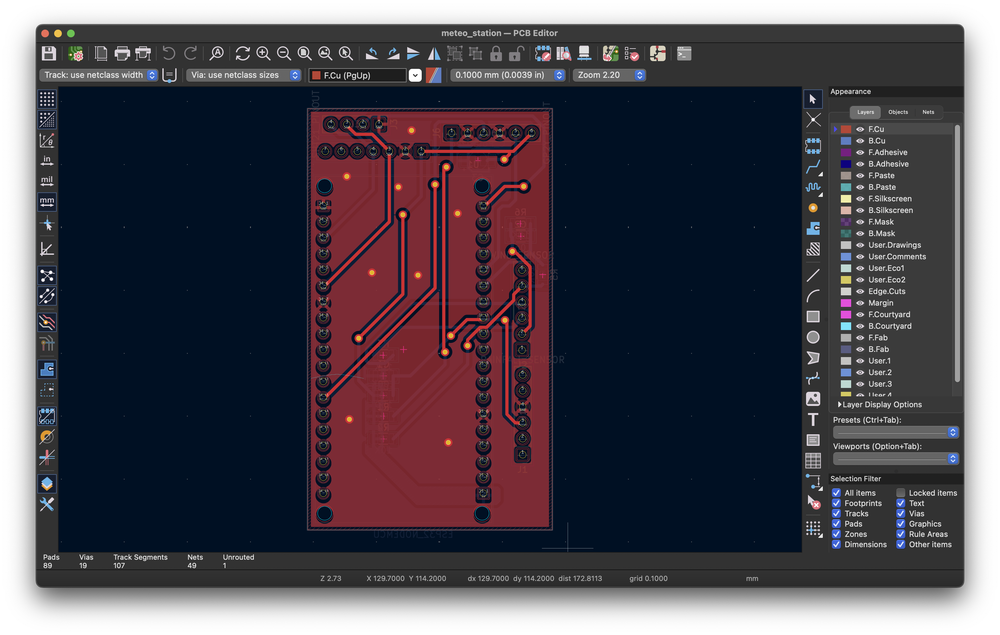
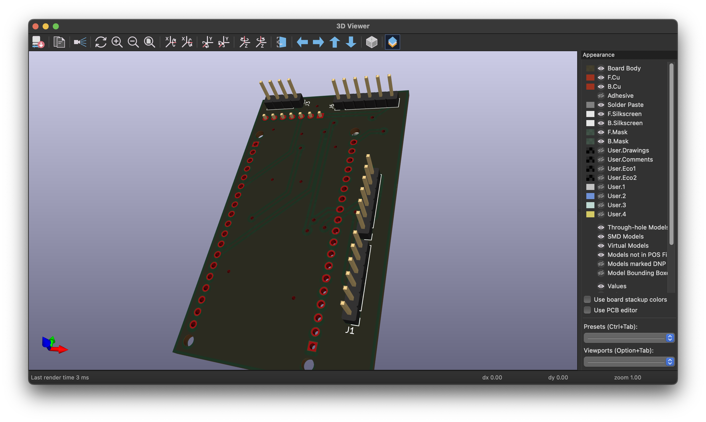
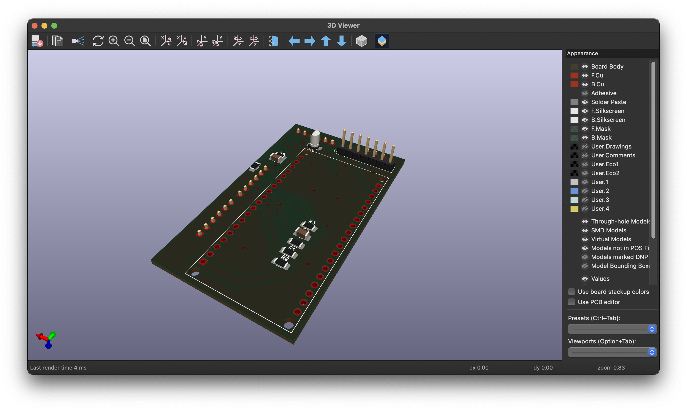
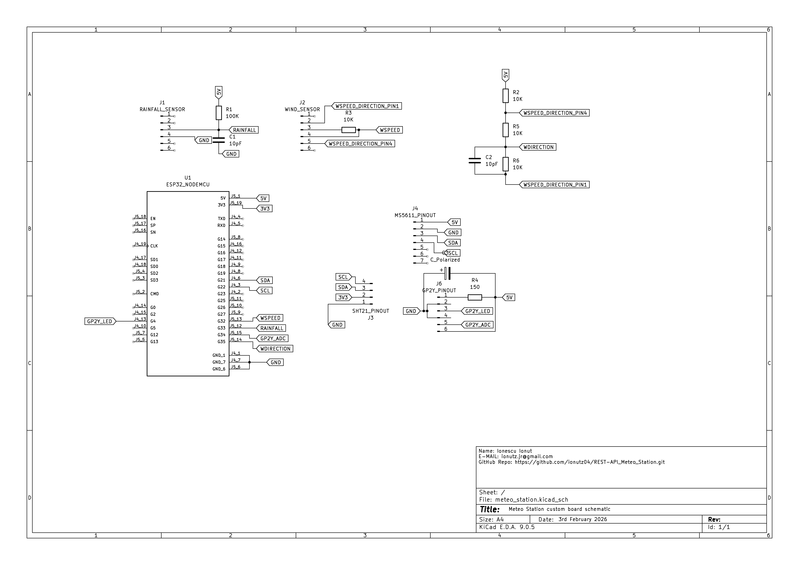

# 🌦️ SHT21 REST API - IoT Weather Monitoring Station

**Collaborators:** Ionescu Ionut

---

## 📝 General Description

This project implements a robust **IoT Weather Monitoring Station** designed for high-accuracy environmental data acquisition. The system is built around an **ESP32 microcontroller** running FreeRTOS (via ESP-IDF) and integrates with a local **NVIDIA Jetson Nano** gateway for data processing and storage.

### System Architecture
- **Edge Node (ESP32):** Collects sensor data via I²C, ADC, and Interrupt Service Routines (ISR).
- **Communication:** Secure HTTPS transmission (Ad-Hoc WiFi) to a Flask REST API.
- **Backend:** Redis TimeSeries database for high-speed storage.
- **Visualization:** Real-time Grafana dashboards.

### 🔑 Key Features
| Feature | Description |
| :--- | :--- |
| **Real-time Acquisition** | Low-latency polling of temperature, humidity, pressure, and wind metrics. |
| **Secure Transport** | JWT-authenticated HTTPS transmission between edge and gateway. |
| **Data Integrity** | Time-series storage with automatic aggregation and persistence. |
| **Visualization** | Custom Grafana dashboards for instant monitoring. |
| **Export Capability** | CSV data export for offline meteorological analysis. |

---

## 🧾 BOM (Bill Of Materials)

| # | Component | Quantity | Description | Interface/Notes |
|:-:|:---|:-:|:---|:---|
| 1 | **ESP32 DevKit** | 1 | ESP32-WROOM-32 Development Board | Main Controller |
| 2 | **SHT21** | 1 | Digital Temp & Humidity Sensor | I²C (0x40) |
| 3 | **MS5611** | 1 | Barometric Pressure Sensor | I²C |
| 4 | **GP2Y Series** | 1 | Optical Dust Sensor (e.g., GP2Y1014AU0F) | Analog + LED Pulse |
| 5 | **SparkFun Weather Meter** | 1 | [SEN-15901](https://www.sparkfun.com/products/15901) Kit | Wind/Rain Assembly |
| 6 | **10kΩ Resistors** | 2 | 1/4W Resistors | Voltage Divider (Wind Vane) |
| 7 | **Nvidia Jetson Nano** | 1 | Orin / 8GB Model | Gateway & ML Server |
| 8 | **Power Supply** | 1 | 5V DC Source | Reliable supply for ESP32 |
| 9 | **Enclosure** | 1 | IP65/Weatherproof Box | Outdoor deployment |

### 🔌 Sensor Pinout Configuration
| Sensor | Signal Type | ESP32 Pin | Logic |
| :--- | :--- | :--- | :--- |
| **Anemometer** | Digital (Pulse) | `GPIO32` | ISR (Falling Edge) |
| **Wind Vane** | Analog (ADC) | `GPIO36` | Voltage Divider Network |
| **Rain Gauge** | Digital (Pulse) | `GPIO33` | ISR (Debounced) |
| **GP2Y1014**| LED - Digital ; photodetector - Analog | `GPIO34` | The LED toggles on 20 $\mu s$ and the analog pin reads the time interval between "the start" of the dust particle and the end of it  |
| **SHT21** | I²C | `SDA/SCL` on address `0x40` | Polling Task |
| **MS5611** | I²C | `SDA/SCL` on address `0x70` | Polling Task |
---

## 🧐 Technical FAQ

### Q1: What is the system boundary?
The system encompasses the **ESP32 firmware** (edge) and the **Jetson Nano microservices** (gateway). External dependencies are strictly limited to standard libraries (ESP-IDF, Flask, Redis, Grafana). The REST API implements a custom AAA (Authentication, Authorization, Accounting) model inspired by industry standards.

### Q2: Where does the intelligence live?
Decision-making is centralized on the **Local Server Gateway (Jetson Nano Orin)**. This device hosts the containerized microservices and executes forecasting algorithms. The ESP32 acts as a "dumb" reliable data pipe.

### Q3: What were the primary engineering challenges?
1.  **State Management:** Implementing Non-Deterministic Finite Automata logic for the REST API to handle MySQL cursors, Redis connections, and JWT verification simultaneously without race conditions.
2.  **Firmware Stability:** Early versions suffered from frequent disconnects due to blocking MySQL cursors freezing the Docker container. Transitioning to a Gunicorn worker model and an asynchronous automata architecture resolved this.

### Q4: Why is this not just a tutorial?
This is not a copy-paste hobby project. It addresses a specific engineering constraint: **"How to build a meteorological station with low latency but high forecasting accuracy."** The architecture prioritizes data integrity and system autonomy over simplicity.

---

## 📅 Development Timeline

### Phase 1: Prototyping (Arduino Framework)
* **20 Dec 2025 - 03 Jan 2026:** Project initiation. Initial implementation using Arduino framework for ESP32 and Flask for the backend, implementation which turned up to be very unstable and very unefficient in battery life for the MCU.
* **14 Jan 2026:** Hardware arrival (SparkFun Meter Kit). Beta testing begins, transfering the initial flask web app to a more production ready system, using multi-threaded solution like gunicorn, sepparating each route task to every worker.
* **14 Jan 2026 - 18 Jan 2026:** Completion of the Arduino-based prototype. Data gathering initiated for initial model training.

### Phase 2: Refactoring (ESP-IDF Migration)
* **20 Jan 2026:** **Critical Decision:** The Arduino framework proved resource-heavy and inefficient. Decision made to migrate to **ESP-IDF** (Espressif IoT Development Framework). The inefficency was found when it was tring a more battery oriented firmware, the deep sleep implementation on the ESP32 turning out to be full of bugs. (At the end of the day "At the end of the day, Arduino is like training wheels on a bicycle, after you learn to walk, it just hinders you." 😎)

* **22 Jan 2026 - 01 Feb 2026:** **Learing ESP-IDF Stage.**
    * Learned FreeRTOS task/queue management.
    * Wrote custom $I^2C$ driver for SHT21.
    * Migrated from simple loops to multi-tasking architecture.

### Phase 3: Production Release
* **04 Feb 2026:** **R&D Complete.**
    * Final firmware deployed using ESP-IDF.
    * **Architecture:** Dedicated FreeRTOS tasks for each sensor (SHT21, MS5611, GP2Y) and even for the meter kit sensors, like anemometer, rain gauge and Wind Vane. For interrupt-dependent sensors, like rain gauge and anemometer, it was implemented a queue for each IRS-Task link, being a solution of debounce or other problems which can be induced by noise.
    * **Connectivity:** Migrated to Ad-Hoc WiFi network (Jetson as AP, ESP32 as STA) for isolated security because the real Meteo Stations are needed in isolated places, and the possibility of not having a wireless connection in order to connect the ESP32 to JON.

### 🚀 Future Roadmap
* Implementation of a multi layer forecaster and orchestrator of the data:
   1. On the 1st layer, it will be the classical model of time-series data forecasting, like ANIMA or Prophet, which will do the raw analysis over the data
   2. On the 2nd layer, it will implemented a simple LLM (Large Language Model), which will decide which type of analysis is needed for this data, and some additional comments over the forecast.

* Getting done the first prototipe board for this meter kit.
For now, the state in which stays the custom PCB which it was designed for this project is close to be the final one, the only modifications that are needed are regaring the footprint of the esp32 and sensors like SHT21, MS5611. The GP2Y will be soldered on the board using a JCTC connector, solderd directly on board.

   Right now, this is the state in which the project is:

   - PCB:

   
   

   - 3D view:

   

   

   - Schematic:
   